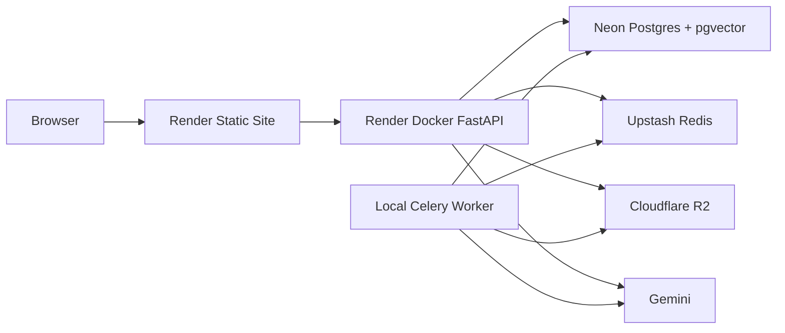

# DocuMind Learning Guide

This guide explains DocuMind from scratch. It is written so a beginner can understand what the project does, why each piece exists, how to run it, and how to explain it in a technical discussion.

## One-Sentence Summary

DocuMind is a RAG documentation workbench that ingests documents, stores searchable embeddings, retrieves relevant chunks for questions, generates citation-backed answers, and evaluates retrieval/answer quality.

## What Problem It Solves

Normal LLMs answer from model memory. That is risky when the answer must come from a specific document. DocuMind solves this by giving the LLM external evidence:

1. Put documents into a corpus.
2. Break documents into chunks.
3. Convert chunks into embeddings.
4. Store embeddings in a vector database.
5. Convert user question into an embedding.
6. Retrieve chunks closest to the question.
7. Ask Gemini to answer using only those chunks.
8. Show citations so answer can be checked.

This is Retrieval-Augmented Generation, or RAG.

## Vocabulary

### Corpus

Corpus means active knowledge base. In DocuMind, corpus is the set of indexed documents currently available for retrieval.

### Chunk

Chunk is a smaller piece of a document. Large documents are split because vector search works better on focused passages than whole files.

### Embedding

Embedding is a list of numbers that represents semantic meaning. Similar text gets similar vectors. DocuMind uses Gemini embeddings and stores them in pgvector.

### Vector Search

Vector search compares question embedding with chunk embeddings. It finds text that is semantically close, not only text that has exact matching words.

### Reranking

Reranking is a second pass after vector search. It reorders candidate chunks so best evidence appears first.

### Citation

Citation links answer sentence back to retrieved chunk. This makes answer inspectable.

### Eval

Eval measures whether retrieval found right evidence and whether generated answer stayed grounded.

## User-Facing Workflow

### 1. API URL

The top control tells frontend where backend lives.

Local:

```text
http://localhost:8000
```

Hosted:

```text
https://documind-rag-api.onrender.com
```

Why it exists: same frontend can talk to local or hosted backend.

### 2. Online Status

The status pill calls `/health`. It tells whether FastAPI is alive.

Why it exists: before uploading or asking, user should know API is reachable.

### 3. Corpus Panel

Corpus panel manages documents.

Controls:

- `Select document`: choose local file.
- URL input: ingest one web page.
- `Async`: use background Celery worker.
- `Ingest`: send file/URL to backend.
- document checkboxes: select retrieval scope.
- `Clear Corpus`: delete indexed docs/chunks and clear answer cache.
- `Ask` and `Eval` tabs: switch main work area.

Why it exists: RAG quality begins with controlled knowledge base.

### 4. Ask View

Ask view lets user ask a question.

Backend steps:

1. Embed question.
2. Retrieve similar chunks from pgvector.
3. Rerank chunks.
4. Build prompt with context blocks.
5. Ask Gemini for grounded answer.
6. Return answer, citations, source chunks, and cache status.

Why source chunks are visible: if answer is wrong, retrieval can be debugged directly.

### 5. Eval Dashboard

Eval dashboard measures quality.

Inputs:

- cases JSON: questions and expected terms/sources
- configs: `top-1`, `top-3`, `top-5`
- selected document scope

Metrics:

- Recall@k: did retrieval find expected evidence?
- MRR: how early did first correct evidence appear?
- Context precision: how much retrieved context was useful?
- Faithfulness: is answer supported by context?
- Answer relevance: does answer address question?

Why it exists: RAG should be tuned with metrics, not only visual confidence.

## Backend Architecture

### FastAPI

FastAPI exposes HTTP endpoints. It validates requests, calls service modules, and returns JSON.

Important endpoints:

- `GET /health`: process alive
- `GET /ready`: database and Redis reachable
- `GET /documents`: list corpus
- `DELETE /documents`: clear corpus
- `POST /documents/upload`: sync file ingestion
- `POST /documents/upload-async`: async file ingestion
- `POST /documents/ingest-url`: sync URL ingestion
- `POST /documents/ingest-url-async`: async URL ingestion
- `GET /documents/jobs/{task_id}`: async status
- `POST /query/retrieve`: raw retrieved chunks
- `POST /query/answer`: generated answer
- `POST /eval/run`: eval dashboard data

Why FastAPI: strong typing, clean JSON APIs, easy file upload support, simple Docker runtime.

### Document Loaders

Loaders turn source files into text.

Supported:

- `.txt`
- `.md`
- `.markdown`
- searchable `.pdf`
- one HTTP/HTTPS page

Why no OCR: scanned PDF OCR adds heavy dependencies and is outside current scope.

### Chunking

Default:

```text
chunk_size=256
chunk_overlap=40
```

Why overlap: important sentence can cross chunk boundary. Overlap preserves context.

### Embeddings

DocuMind has provider boundary:

- local hash embeddings for tests
- Gemini embeddings for real demo
- Redis cached wrapper

Why provider boundary: tests should run without API keys, while demo uses real semantic retrieval.

### Database

Neon Postgres stores:

- documents table
- document_chunks table
- pgvector embeddings
- vector index

Why Postgres with pgvector: metadata and vectors stay in one database; no separate vector DB needed for this scale.

### Cache

Upstash Redis caches:

- embeddings
- answers

Why: repeated questions/text should not repeatedly call Gemini.

### Celery

Celery processes async ingestion.

Why: embedding many chunks can take time. Async mode keeps API responsive and shows background job design.

### R2

Cloudflare R2 stores original files.

Why: database stores searchable chunks, object storage stores original artifacts.

### Gemini

Gemini generates:

- embeddings
- answers

Why: real model provider makes demo behavior closer to production RAG.

## Deployment Architecture



Frontend is static because React builds to files. Backend is Docker because Python API needs a runtime. Worker is local because async demo does not need always-on hosted compute.

## Run From Scratch

### Hosted Demo

Fastest path:

1. Open `https://documind-rag-workbench.onrender.com`.
2. Confirm API URL is `https://documind-rag-api.onrender.com`.
3. Upload small document.
4. Keep `Async` off.
5. Click `Ingest`.
6. Ask factual question.
7. Check citations.
8. Open Eval and run cases.

### Local Demo

Prerequisites:

- Docker Desktop
- `.env` filled with Neon, Upstash, R2, Gemini credentials

Run:

```bash
cp .env.example .env
docker compose -f docker-compose.managed-local.yml run --rm api python -m app.db_cli ensure-schema --env-file .env
docker compose -f docker-compose.managed-local.yml up --build
```

Open:

```text
http://localhost:5173
```

Stop:

```bash
docker compose -f docker-compose.managed-local.yml down
```

## How To Explain In Interview

### Short Explanation

DocuMind is a full RAG workbench. It has ingestion, chunking, embeddings, pgvector retrieval, reranking, Gemini answer generation, citations, Redis caching, Celery async jobs, document scoping, and an eval dashboard. Frontend is deployed as a Render Static Site. Backend is deployed as a Docker web service. Managed services provide database, cache/queue, object storage, and model calls.

### Why This Is More Than A Chatbot

A chatbot only sends prompt to model. DocuMind manages evidence. It controls corpus, retrieves context, exposes sources, and measures quality.

### Why Eval Matters

RAG systems fail in two ways:

- retrieval fails to find right context
- generation ignores or distorts context

Eval separates those failures through retrieval metrics and answer-quality metrics.

### Why Architecture Is Practical

It avoids unnecessary paid hosting for worker while still showing real production-style boundaries:

- disposable app runtime
- durable database
- external queue/cache
- object storage
- model provider
- observable health/readiness checks

