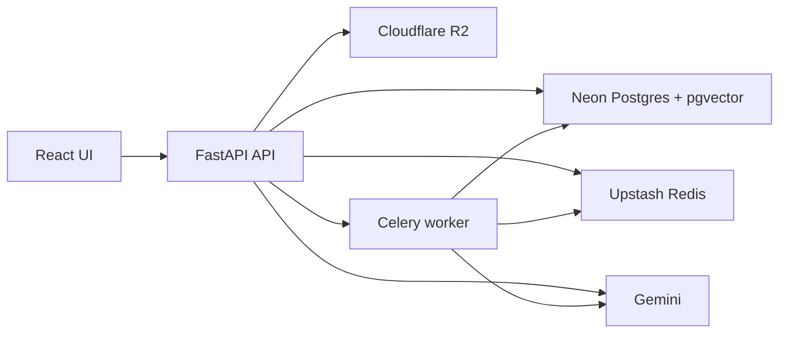

# DocuMind System Design

DocuMind is a local-first documentation RAG workbench. Its app processes run on the laptop through Docker Compose, while persistence and model calls use managed services. That gives the project real RAG boundaries without requiring an always-on public deployment.

## Goals

DocuMind is built to prove the complete RAG loop:

1. Ingest documents from file upload or URL.
2. Preserve original source files.
3. Split text into searchable chunks.
4. Embed chunks into vectors.
5. Store chunks and vectors in Postgres with pgvector.
6. Retrieve relevant chunks for a user question.
7. Generate grounded answers with citations.
8. Show retrieved sources for inspection.
9. Evaluate retrieval and answer quality.

The goal is not public uptime. There are no active users requiring a hosted service, so paid always-on compute would increase cost without improving the core system.

## Runtime Components

### React Frontend

Runs at `http://localhost:5173`.

Responsibilities:

- gives operator one UI for corpus, ask, and eval workflows
- stores API base URL in browser `localStorage`
- uploads files with `FormData`
- sends URL ingest requests
- polls Celery job status when async mode is enabled
- displays indexed document count and chunk count
- lets operator scope ask/eval to selected documents
- shows answer text, citations, source chunks, and eval metrics

Why React:

- fast to build a single-page workbench
- stateful UI fits upload status, selected corpus scope, recent answers, and eval state
- Vite development server gives quick local iteration

### FastAPI Backend

Runs at `http://localhost:8000`.

Responsibilities:

- exposes health and readiness checks
- accepts uploads and URL ingest requests
- parses supported document formats
- calls ingestion service
- retrieves similar chunks
- generates answers
- runs eval configs
- returns typed JSON responses through Pydantic schemas

Why FastAPI:

- simple API surface with strong typing
- automatic request validation through Pydantic
- good async/file-upload support
- easy local Docker runtime

### Celery Worker

Runs as a separate local container.

Responsibilities:

- handles slow ingestion in background
- keeps API responsive for async uploads
- performs chunking, embedding, database writes, and cache invalidation

Why Celery:

- ingestion can become slow because embedding calls are external model calls
- background work should not block API request threads
- Redis broker/result backend is enough for this project shape

### Neon Postgres With pgvector

External managed database.

Responsibilities:

- stores document metadata in `documents`
- stores chunk text, token count, metadata, and embeddings in `document_chunks`
- performs vector similarity search using pgvector cosine distance

Why Postgres plus pgvector:

- keeps document metadata and embeddings in one database
- avoids introducing a separate vector database for project scale
- Postgres is familiar, queryable, durable, and easy to inspect
- pgvector gives semantic search while keeping SQL filtering available

### Upstash Redis

External managed Redis.

Responsibilities:

- caches embeddings
- caches repeated answer responses
- acts as Celery broker
- stores Celery task results

Why Redis:

- repeated questions and repeated embedding inputs should not call models again
- async ingestion needs a queue and result store
- managed Redis avoids running another local service

### Cloudflare R2

External object storage.

Responsibilities:

- stores original uploaded files
- stores fetched URL source payloads
- returns durable `r2://bucket/key` URIs stored with document metadata

Why object storage:

- original files can be larger than database rows should be
- source artifacts should survive app container restarts
- indexes can be rebuilt later from original files if needed

### Gemini

External model provider.

Responsibilities:

- generates user-facing answers
- embeds document chunks
- embeds user questions

Why Gemini:

- real semantic embeddings and answer generation make local demo closer to real RAG behavior
- provider boundary keeps model code replaceable
- same API key family can support both generation and embeddings

## High-Level Flow

## Ingestion Flow

1. User selects a file or enters a URL.
2. Frontend sends request to API.
3. API validates file or URL payload.
4. API extracts text through document loaders.
5. API stores original source bytes in R2.
6. API creates `IngestionInput`.
7. Text is tokenized and split into overlapping chunks.
8. Each chunk is embedded with `task_type="RETRIEVAL_DOCUMENT"`.
9. Schema is ensured in Neon.
10. Document metadata is inserted or updated by content hash.
11. Existing chunks for the same document are deleted.
12. New chunks and embeddings are inserted.
13. Answer cache is invalidated because corpus changed.

Why content hash:

- same content should not create duplicate documents
- re-upload can update title/source URI while preserving logical document identity

Why overlap:

- answers often cross chunk boundaries
- overlap reduces lost context at edges
- default `256` chunk size and `40` overlap are small enough for focused retrieval and large enough to preserve meaning

## Ask Flow

1. User enters question.
2. Frontend sends `/query/answer`.
3. Backend builds answer cache key from:
   - question
   - `top_k`
   - selected document IDs
   - embedding provider and dimension
   - reranker provider and candidate multiplier
   - generation provider and model
4. Redis is checked for cached answer.
5. If cache miss, question is embedded with `task_type="RETRIEVAL_QUERY"`.
6. pgvector retrieves candidate chunks by cosine similarity.
7. Candidate count is `top_k * RERANKER_CANDIDATE_MULTIPLIER`, capped at `100`.
8. Reranker chooses final top chunks.
9. Gemini receives question plus retrieved context blocks.
10. Gemini answers using only provided context.
11. Backend returns answer, citations, and source chunks.
12. Response is cached in Redis.

Why cache key includes document scope:

- same question can have different correct answers for different selected documents
- cache must not leak answers across scopes

Why retrieval and answer endpoints are separate:

- `/query/retrieve` exposes raw retrieval behavior for debugging
- `/query/answer` adds generation on top of same retrieval path
- this separation makes RAG quality visible instead of hiding it behind prose

## Eval Flow

1. User opens Eval dashboard.
2. User keeps default cases or edits `Cases JSON`.
3. Frontend sends `/eval/run` with cases, configs, and document scope.
4. Backend runs each config, such as `top-1`, `top-3`, and `top-5`.
5. Each case retrieves chunks using same retrieval path as normal questions.
6. Expected terms or source URI determine retrieval match.
7. Answer generator creates answer for retrieved chunks.
8. Answer-quality evaluator scores faithfulness and relevance.
9. Dashboard displays metric cards and case table.

Why eval exists:

- RAG quality cannot be judged only by a nice answer
- retrieval must find correct evidence
- answer must stay grounded in retrieved evidence
- comparing `top_k` values reveals precision/recall tradeoffs

## Main Data Model

### `documents`

Purpose: one row per indexed source document.

Important fields:

- `id`: stable UUID
- `title`: display name from upload or URL
- `source_type`: text, markdown, pdf, or url-derived type
- `source_uri`: R2 URI or source URL-derived storage URI
- `content_sha256`: deduplication key
- `created_at`: ingestion timestamp

### `document_chunks`

Purpose: one row per searchable chunk.

Important fields:

- `id`: chunk UUID
- `document_id`: parent document
- `chunk_index`: order inside document
- `content`: chunk text
- `token_count`: approximate token count from whitespace tokenizer
- `embedding`: pgvector column
- `metadata`: future extension point

Why chunk rows reference documents:

- document deletion cascades to chunks
- retrieval can filter by document IDs
- UI can show source title and source URI for citations

## Provider Boundaries

DocuMind uses provider factories for model and storage concerns:

- `create_embedding_provider`
- `create_answer_generator`
- `create_answer_quality_evaluator`
- `create_reranker`
- `create_document_storage`
- `create_cache`

Why:

- tests can use deterministic local providers
- local demo can use Gemini for core model behavior
- heavier optional providers can be enabled without changing API route code
- each dependency has one interface and one responsibility

## Local-Only Hosting Rationale

DocuMind is intentionally not deployed to public cloud as an always-on service. The current project has no real user traffic or uptime requirement. Paying for always-running API, worker, and frontend compute would demonstrate hosting, but it would not improve ingestion, retrieval, generation, or evaluation quality.

Instead, the project keeps the parts that matter for RAG architecture:

- real managed database
- real managed Redis
- real object storage
- real model provider
- reproducible local containers

This keeps cost low while preserving the engineering boundaries that would matter if the project later needed public availability.

## Failure Modes And Controls

- API down: frontend health pill turns non-ready.
- Database unreachable: `/ready` fails.
- Redis unreachable: `/ready` fails and Celery/cache path breaks.
- Bad R2 credentials: upload or URL ingest fails when storing source file.
- Bad Gemini key: embedding or generation fails.
- Bad eval JSON: Eval dashboard shows validation error.
- Corpus pollution: operator can select document scope or clear corpus.
- Stale cached answers: ingestion and corpus clear delete `answer:` cache prefix.

## What Would Scale Later

If DocuMind gained real users, next architecture steps would be:

- user accounts
- workspaces
- document collections
- access control on retrieval
- stored eval runs
- queue retry/dead-letter policy
- observability for latency, cache hit rate, and worker queue depth
- public edge with HTTPS

These are intentionally out of current scope because local technical correctness is the priority.
